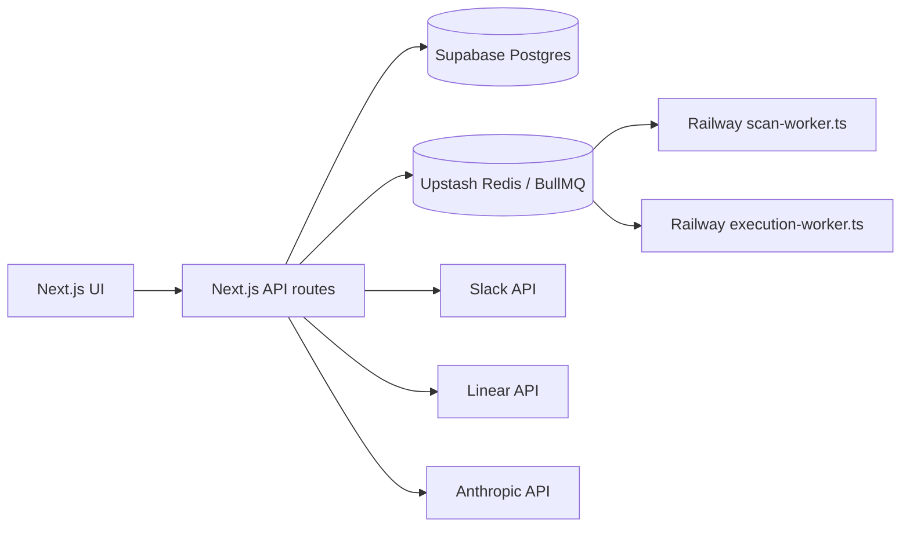
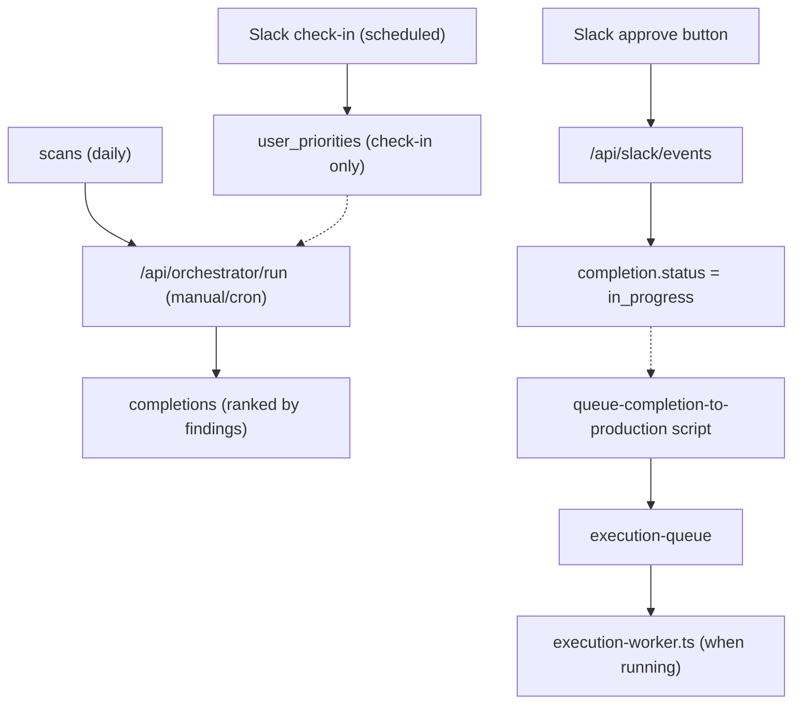
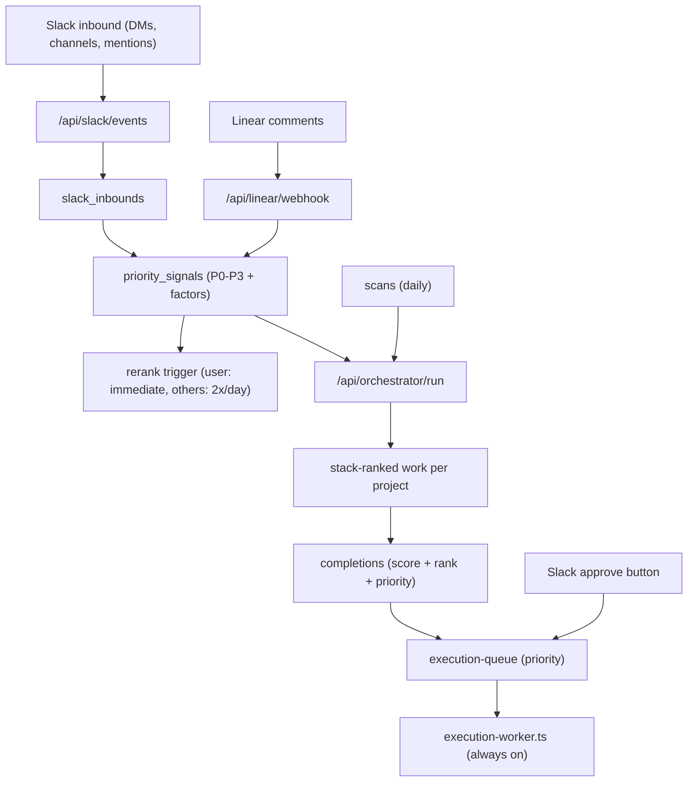
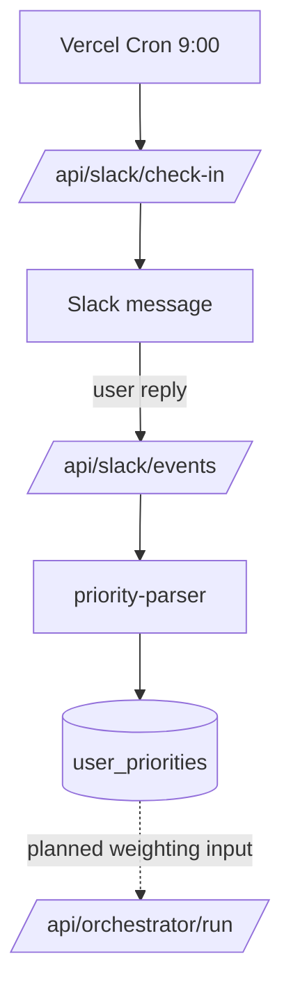
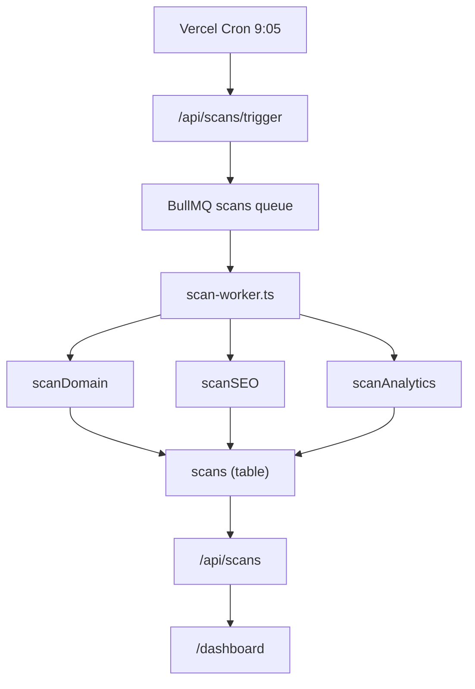
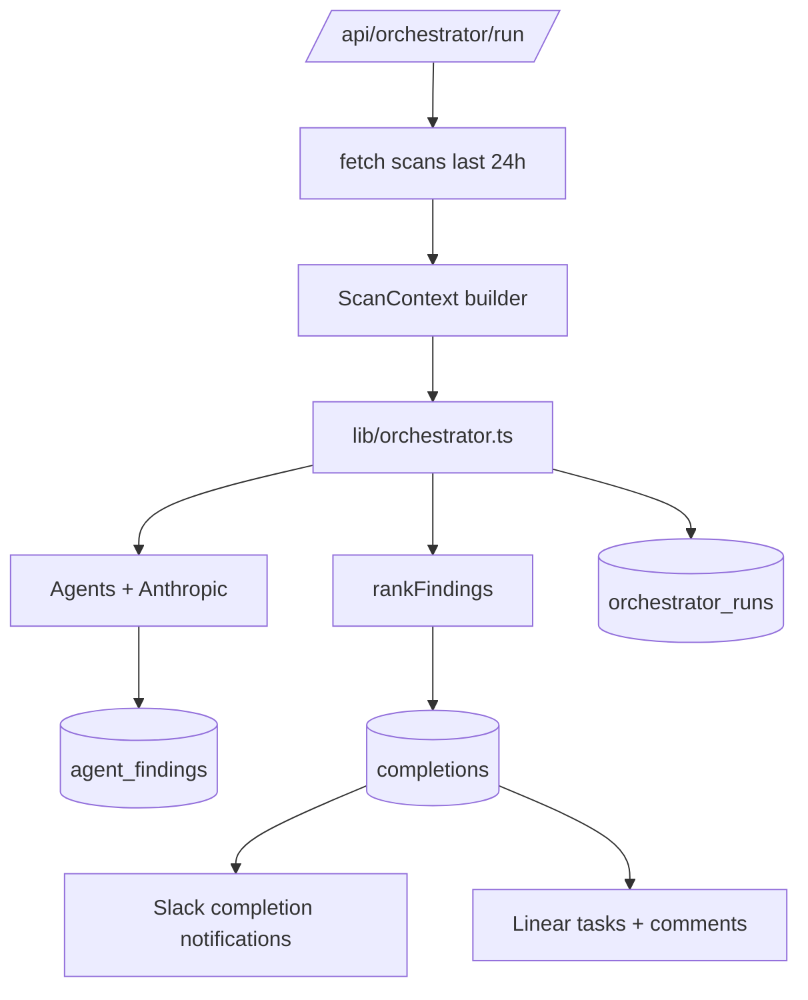
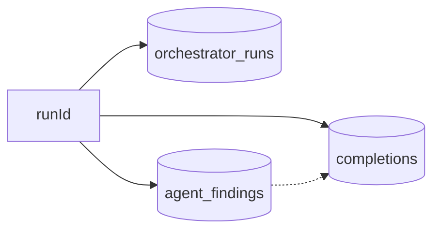
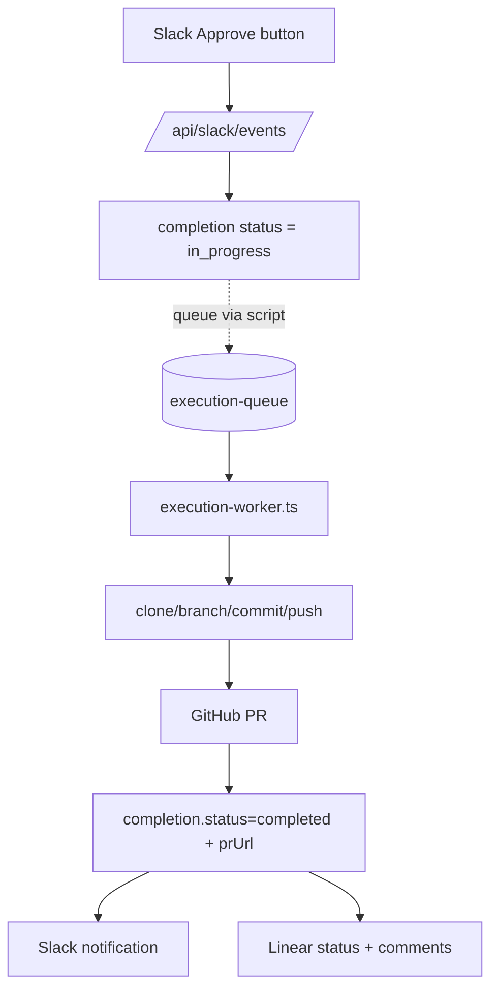
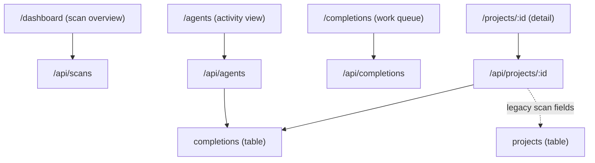
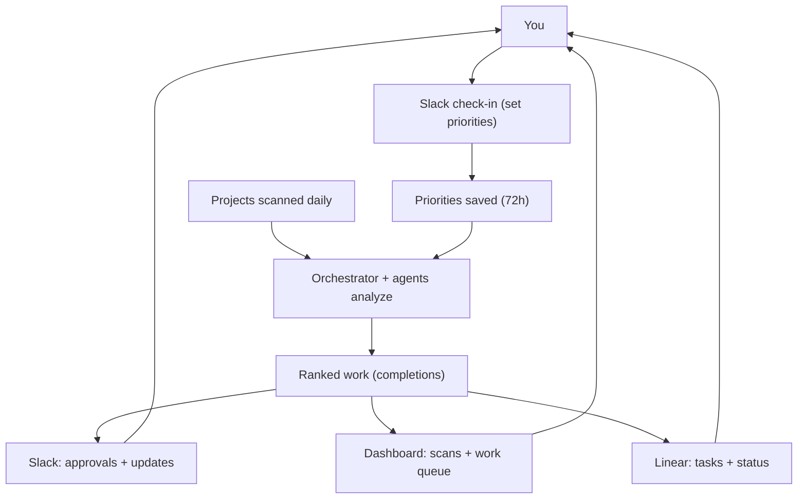

# Virtual Cofounder Workflow Diagrams

These mermaid diagrams show how scans, orchestrator runs, agents, Slack, and execution fit together.

## 1) System Overview

## Change View (Before)

## Change View (After)

## 2) Priority Intake (Slack Check-in)

## 3) Scanning Pipeline

## 4) Orchestrator Run + Outputs

## 5) Run Data Lineage

## 6) Execution Worker Pipeline

## 7) UI Data Surfaces

Notes:
- Agents UI currently derives activity from `completions` text, not `agent_findings`.
- Project detail API uses legacy scan fields; the canonical scan data is in `scans`.

## 8) User-Facing UX Flow (Your Perspective)

