# Virtual Cofounder Workflow Diagrams

These mermaid diagrams show how scans, orchestrator runs, agents, Slack, and execution fit together.

## 🚀 Official Claude Agent SDK Integration Plan

**Status**: Proposed | **Priority**: P0 (Foundational architecture)
**SDK**: `@anthropic-ai/claude-agent-sdk` v0.2.1 (published Jan 7, 2026)

**Major Discovery**: The official Claude Agent SDK was published 2 days ago! We can use the official SDK instead of manual tool implementation.

**Why This Changes Everything**:
- ❌ **OLD PLAN**: Manually implement tool loops with `anthropic.beta.tools.messages.create()`
- ✅ **NEW PLAN**: Use official SDK with built-in Read/Write/Edit/Bash/Glob/Grep tools, subagents, hooks, sessions

**Solution**: 4-phase rollout with official SDK (10x simpler than manual implementation)

- **Phase 1 (P0):** Execution Worker code generation (built-in tools, +$7.50/mo, 2-3 days)
- **Phase 2 (P0):** Priority system (P0-P3, stack ranking, all Slack signals, +$5/mo, 5-6 days)
- **Phase 3 (P1):** Specialist agents as subagents (Task tool, +$112.50/mo, 3-4 days)
- **Phase 4 (P2):** Head of Product meta-orchestrator (+$25/mo, 3-4 days)
- **Phase 5 (P1):** UI updates (stack-ranked lists, execution queue, chat history, 5-6 days)

📄 **Full Plan**: [agent-sdk-integration-plan.md](./agent-sdk-integration-plan.md) (18-23 days, +$150/month total)

## 1) System Overview

## Change View (Before)

## Change View (After)

## ✅ What We Keep vs 🔄 What We Replace

### ✅ KEEP (Working Infrastructure)

- **BullMQ Queue System** (orchestrator, execution, scans queues)
- **Scan Workers** (domain, SEO, analytics, security scanners)
- **Database Schema** (workspaces, projects, scans, etc.)
- **Slack Integration** (lib/slack.ts - message sending, threads)
- **Linear Integration** (lib/linear.ts - tasks, updates)
- **Git Operations** (lib/git.ts - clone, commit, push)
- **GitHub Integration** (lib/github.ts - PR creation)
- **Next.js API Routes** (/api/scans, /api/projects, etc.)
- **Railway Deployment** (always-on worker hosting)

### 🔄 REPLACE with Official Claude Agent SDK

- **execution-worker.ts:180-189** → Code Generation Agent using SDK's `query()` with built-in Read/Write/Edit/Bash tools
- **lib/orchestrator.ts runAgent()** → Spawn subagents via SDK's Task tool
- **lib/agents.ts** → Convert to `AgentDefinition` objects (SDK format)
- **lib/orchestrator.ts getRelevantAgents()** → Meta-agent spawns adaptively via Task tool
- **lib/orchestrator.ts rankFindings()** → Incorporate priority_signals
- **Slack check-in priorities** → priority_signals table (all signals)
- **Manual execution script** → Auto-enqueue on Slack approve

**Key Insight:** We're not rebuilding infrastructure—we're upgrading to official SDK. All the plumbing (queues, workers, integrations) stays. The SDK gives us built-in tools, subagents, hooks, sessions, and automatic thinking traces with 10x less code.

## 🤖 Agent SDK Integration Points

*Note: All agents use official `@anthropic-ai/claude-agent-sdk` v0.2.1. The SDK provides built-in tools (Read, Write, Edit, Bash, Glob, Grep), subagent spawning via Task tool, hooks for lifecycle events, and automatic thinking traces.*

## 2) Priority Intake (Slack Check-in)

## 3) Scanning Pipeline

## 4) Orchestrator Run + Outputs (Current - Manual)

## 4b) Orchestrator with Agent SDK (Proposed)

## 5) Run Data Lineage

## Claude SDK Usage (Actual)

Note: the Claude Agent SDK is not used; the code calls the Anthropic SDK directly.

## 6) Execution Worker Pipeline

## 7) UI Data Surfaces

Notes:
- Agents UI currently derives activity from `completions` text, not `agent_findings`.
- Project detail API uses legacy scan fields; the canonical scan data is in `scans`.

## 8) User-Facing UX Flow (Your Perspective)

## 9) User Interaction Flows (With Agent SDK)

### Priority Setting & Work Generation

```mermaid
graph TD
  User[User] -->|"DM: Fix auth bug"| SlackBot[Slack Bot]
  User -->|"@mention in channel"| SlackBot
  User -->|"React with 🔥"| SlackBot
  User -->|"Create Linear issue"| LinearWebhook[Linear Webhook]
  User -->|"Comment: this is urgent"| LinearWebhook

  SlackBot --> PrioritySignals[(priority_signals)]
  LinearWebhook --> PrioritySignals

  PrioritySignals -->|"Immediate rerank"| Orchestrator[Head of Product Agent]
  Orchestrator -->|"Spawn specialist agents"| Specialists[Security/Analytics/SEO Agents]
  Specialists -->|"Findings + evidence"| StackRank[Stack-Ranked Lists]

  StackRank --> SlackThread[Slack Thread: Proposed Work]
  SlackThread -->|"✅ Approve"| ExecQueue[(execution-queue FIFO)]
  SlackThread -->|"💬 Feedback"| Orchestrator
  SlackThread -->|"❌ Reject"| Rejected[Mark rejected]

  ExecQueue --> CodeGenAgent[Code Generation Agent]
  CodeGenAgent -->|"Real-time updates"| SlackUpdates[Slack: thinking traces]
  CodeGenAgent -->|"Status updates"| LinearComments[Linear: progress comments]
  CodeGenAgent -->|"PR created"| GitHubPR[GitHub PR]

  GitHubPR --> LinearDone[Linear: Done + PR link]
  GitHubPR --> SlackDone[Slack: PR ready for review]
```

### Agent Thinking Traces Flow

```mermaid
sequenceDiagram
  participant User
  participant Slack
  participant Orchestrator
  participant SecurityAgent
  participant CodeGenAgent
  participant Linear

  User->>Slack: Approve "Fix SSL certificate issue"
  Slack->>Orchestrator: completion.status = in_progress
  Orchestrator->>SecurityAgent: Spawn via Task tool

  SecurityAgent->>Slack: 🤔 "Analyzing SSL configuration..."
  SecurityAgent->>Linear: Comment: "Checking certificate expiry"
  SecurityAgent->>SecurityAgent: Use fetch_url tool
  SecurityAgent->>Slack: 🤔 "Certificate expires in 7 days"
  SecurityAgent->>Linear: Comment: "Found: cert expires Jan 15"

  SecurityAgent-->>Orchestrator: Evidence: {expiry: "2026-01-15", provider: "Let's Encrypt"}
  Orchestrator->>CodeGenAgent: Generate renewal script

  CodeGenAgent->>Slack: 🤔 "Reading existing cert config..."
  CodeGenAgent->>Linear: Comment: "Creating renewal automation"
  CodeGenAgent->>CodeGenAgent: Use Read/Write/Edit tools
  CodeGenAgent->>Slack: 🤔 "Created certbot automation script"
  CodeGenAgent->>Linear: Comment: "Added weekly renewal cron job"

  CodeGenAgent->>Linear: Status: Done + PR link
  CodeGenAgent->>Slack: ✅ "PR #123 ready: SSL auto-renewal"
  Slack->>User: Notification with PR link
```

### Daily Orchestration Cycle

